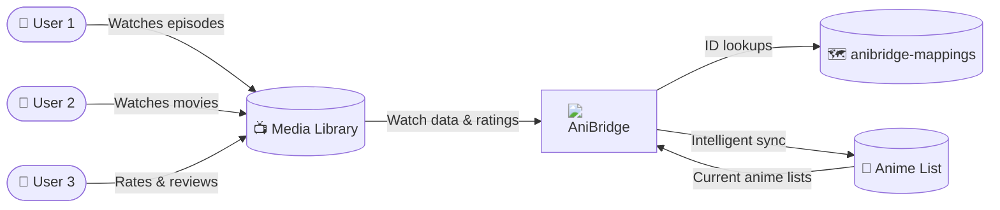

#  AniBridge

The smart way to keep your anime lists perfectly synchronized.

  

> [!IMPORTANT]
> Visit the [AniBridge documentation](https://anibridge.eliasbenb.dev) for detailed setup instructions and usage information.

AniBridge is a media synchronization tool designed to keep your activity synchronized across different media viewing and tracking platforms. With its [mappings database](https://github.com/anibridge/anibridge-mappings) of over 60K entries tailored specifically for anime titles, AniBridge is particularly focused on anime content, however can be expanded to support more with [custom mappings](https://anibridge.eliasbenb.dev/mappings/custom-mappings).

## Key Features

- **🔄 Comprehensive Synchronization**: Synchronizes watch status, progress, ratings, reviews, and start/completion dates between your anime library and list.
- **🔗 Provider-Agnostic**: Supports multiple media library and anime list providers through a flexible plugin system (Plex, Jellyfin, Emby, AniList, MyAnimeList).
- **🎯 Smart Content Matching**: Uses a curated mappings database with fuzzy title search fallback and support for custom mapping overrides.
- **⚡ Optimized Performance**: Intelligent batch processing, rate limiting, and caching to minimize API usage while maximizing sync speed.
- **👥 Multi-User & Multi-Profile**: Define multiple profiles to simultaneously synchronize different users, libraries, and servers with granular configuration.
- **🖥️ Web Dashboard**: Intuitive web interface with a real-time sync timeline, profile management, custom mapping editor, and log viewer.
- **🛡️ Safe & Reliable**: Built-in dry run mode for testing and automatic backups with restoration through the web UI for easy recovery.
- **🐳 Easy Deployment**: Docker-ready with easy YAML-based configuration.

## Web UI Screenshot

_View more screenshots in the [documentation](https://anibridge.eliasbenb.dev/web/screenshots)_
